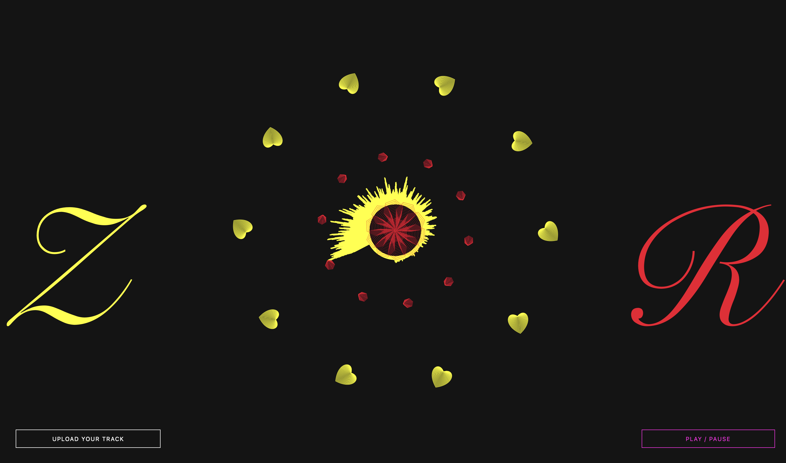
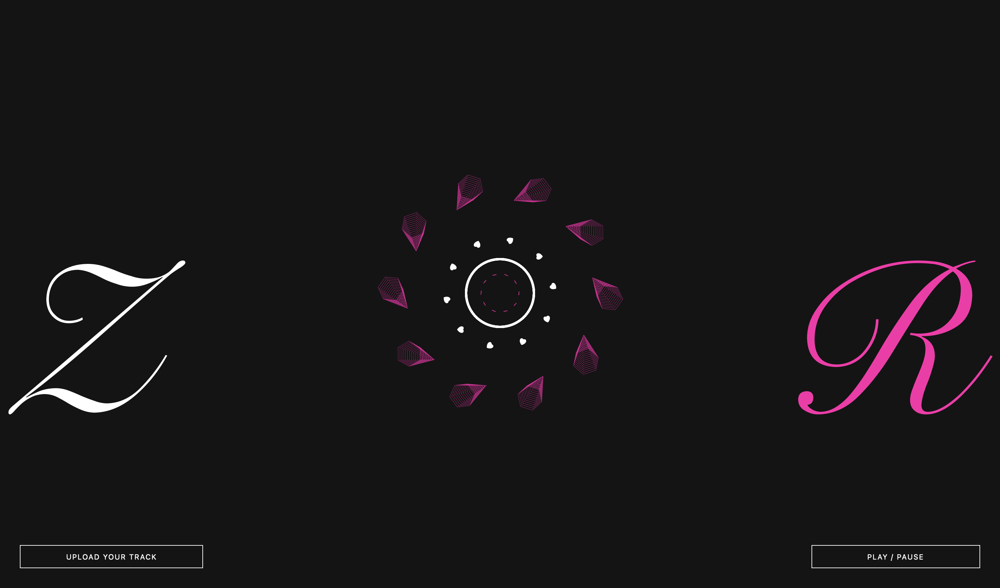

# Audio Visualization

## Rinki and Zohaib

---

### Topic

Our final project topic is audio visualization. We created visuals based off of an audio’s STFT resulting frequencies and decibel values, as the audio plays. The visualization has a center circle, spinning polygons based on bass, treble, and mid frequencies, and rectangles with changing lengths.

### Approaches Taken

---

We used the p5.js library in Javascript for our code. We referenced the following source as an example: https://github.com/codrops/AudioVisualizers/blob/master/js/main1.js. We altered the code from this source to read the amplitude of the audio ranging from [0,1], and used this as the ratio in the equation: 20*log(ratio), to retrieve the decibel value of the audio. We then mapped the decibel value to 12 equidistant cutoffs for the decibel range -60 to 0. These cutoffs are 5 decibels apart, which we know means that the audio is 5 times louder due to the logarithmic scale. We used these cutoffs to determine which of the 12 colors to assign to the audio’s rectangular bars and the color of the polygons associated with treble frequencies. These colors are also used in some of the spinning polygon shapes surrounding the center. For the bass and mid polygons, we map the decibel values from 11 to 0. We use this value to determine the color assigned to the polygons representing the bass and mid frequencies.
Additionally, the STFT result, “spectrogram,” which is an array of amplitudes along the frequency domain, was used to create the height of rectangles arranged around a circle. A single bin has a value from 0 to 255, and every bin is a value in “spectrogram”. Every change in the rectangle's height represents a value of “spectrogram.” There are 1024 rectangles around the center circle, each representing a single frequency bin. We ran FFT with a bin array length of 1024 and smoothing of 0.9. The smoothing function serves as a low pass filter.

We retrieve the “mid” frequencies from the “spectrogram”, and map these values to a range of 0.005 to 0.03. These mapped values are named scaleMid. These values correspond to the outer polygons of the circle when the audio is not playing. These polygons appear in the middle of the center circle as a pinwheel when the audio is on. The change in rectangle height is a value from each of the 1024 bins, and we map these values from 5 to 80. This is then multiplied by the radius of the center circle and scaleMid, to make the scale of all bars grow.

When the audio is not playing, the inner lines correspond to the bass frequencies, and these lines turn into different shapes depending on the frequencies. We define the “bass” frequencies as values of “spectrogram” from 100 to 150Hz. We map these from 0 to 5, and named this shapeBass. We use the polygon function from our source to create shapes. We change the shapes of the polygons based on bass by creating polygons with points from 3 to shapeBass+3.
The hearts arranged in a circle represent the treble frequencies. We map the treble frequencies from 1 to 5, and these mapped values are named scaleTreble. This value is used to change the size of the hearts when the audio is playing.

### How to Run Our Code

---

Our code is available at [Audio Visualization](https://zdon-official.github.io/Audio-Visualization/.).

### Demonstrated Results

---

